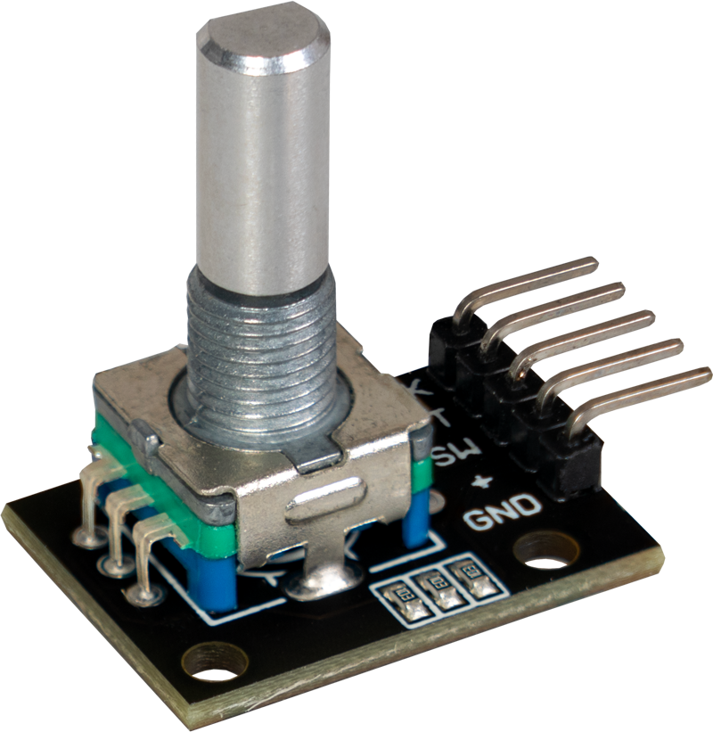

# HW-040/KY-040 Rotary Encoder Library

Arduino library for the KY-040 rotary encoder with **software debouncing** and **interrupts** support.



## Features

- Callback functions on click and rotate events
- Software debouncing
- Interrupts support
- Compatible with Arduino, ESP8266, and ESP32

## Tested on hardware

- Arduino Uno
- Wemos D1 R2
- ESP32

## Wiring

| KY-040 Pin | Board Pin |
|------------|-----------|
| VCC        | 3.3V      |
| GND        | GND       |
| SW         | D7        |
| DT         | D6        |
| CLK        | D5        |

## Usage

### Basic mode (polling)

```cpp
#include "KY040-rotary.h"

KY040 Rotary(5, 6, 7);  // CLK, DT, SW

void OnButtonClicked() { Serial.println("Clicked"); }
void OnButtonLeft()    { Serial.println("Left"); }
void OnButtonRight()   { Serial.println("Right"); }

void setup() {
  Serial.begin(9600);
  Rotary.Begin();

  Rotary.OnButtonClicked(OnButtonClicked);
  Rotary.OnButtonLeft(OnButtonLeft);
  Rotary.OnButtonRight(OnButtonRight);
}

void loop() {
  Rotary.Process(millis());
}
```

### Interrupt mode

```cpp
#include "KY040-rotary.h"

KY040 Rotary(5, 6, 7);

void OnButtonClicked() { Serial.println("Clicked"); }
void OnButtonLeft()    { Serial.println("Left"); }
void OnButtonRight()   { Serial.println("Right"); }

void SwitchInterruptHandler() { Rotary.HandleSwitchInterrupt(); }
void RotateInterruptHandler() { Rotary.HandleRotateInterrupt(); }

void setup() {
  Serial.begin(9600);
  Rotary.Begin(SwitchInterruptHandler, RotateInterruptHandler);

  Rotary.OnButtonClicked(OnButtonClicked);
  Rotary.OnButtonLeft(OnButtonLeft);
  Rotary.OnButtonRight(OnButtonRight);
}

void loop() {
  Rotary.Process(millis());
}
```

## API Reference

### Constructor

```cpp
KY040(uint8_t pinClk, uint8_t pinDt, uint8_t pinSw)
```

### Methods

| Method | Description |
|--------|-------------|
| `Begin()` | Initialize in polling mode |
| `Begin(isr sw, isr rotate)` | Initialize in interrupt mode |
| `Process(unsigned long t)` | Call in `loop()` with `millis()` to process events |
| `OnButtonClicked(callback)` | Register callback for button click |
| `OnButtonLeft(callback)` | Register callback for counter-clockwise rotation |
| `OnButtonRight(callback)` | Register callback for clockwise rotation |
| `HandleSwitchInterrupt()` | ISR handler for button — call from your ISR wrapper |
| `HandleRotateInterrupt()` | ISR handler for rotation — call from your ISR wrapper |

## License

MIT License — see [LICENSE](LICENSE) for details.
